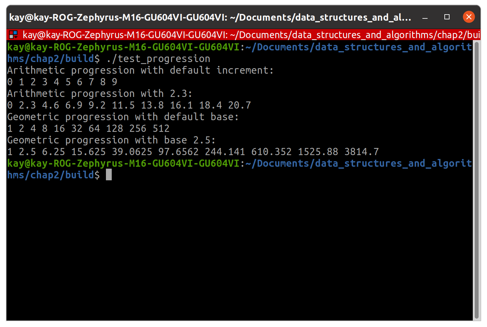

# data_structure_study

## Chapter 2

How to build the programs.

```
mkdir build
```

```
cmake .. && make
```

```
./test_progression
```

The classes below is made of template, so you can easily specify the type of the class.

Base class: Progression

Derived classes: ArithProgression, GeomProgression

How to use the class.

1. Declare the shared pointer.
```
boost::shared_ptr< Progression<double> > Prog_ptr;
```

2. Make use of shared_ptr.
```
Prog_ptr = 
boost::shared_ptr< ArithProgression<double> >
(new ArithProgression<double>(2.3));
```


